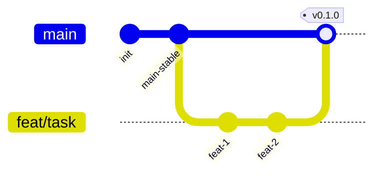

# AGENTS.md — правила работы в сервис-репозитории

`cybercity-data` — один микросервис cybercity (Python, CLI-инструмент сборки
артефактов города + broker producer `city.build.completed`), деплой контейнером.
Системный контекст, состав и контракты — в хабе
[`cybercity/COMPOSITION.md`](https://github.com/TheCipherKeeper/cybercity/blob/main/COMPOSITION.md).
Топология — `<methodology-repo>/docs/refs/TOPOLOGY.md`, общение микросервисов —
`<methodology-repo>/docs/refs/COMMUNICATION.md`. Начни с
`<methodology-repo>/docs/INDEX.md`.

Здесь и далее
`<methodology-repo>` = [`TheCipherKeeper/ai-project-template`](https://github.com/TheCipherKeeper/ai-project-template).

## Документация (приоритет)

`хаб → этот AGENTS.md → методология (guide/ + refs/ — равные, разные виды) →
рабочие артефакты (docs/ARCHITECTURE.md, docs/BACKLOG.md, docs/specs/) → код`.

Приоритет арбитражирует **только между ярусами**. Противоречие **внутри яруса** —
**дефект** (чинят к одной правде либо ADR в хабе), а не «старший побеждает».

Над репозиторием — хаб `cybercity` держит системные документы:
[`cybercity/COMPOSITION.md`](https://github.com/TheCipherKeeper/cybercity/blob/main/COMPOSITION.md)
(канон состава/контрактов/границы),
[`cybercity/CONVENTIONS.md`](https://github.com/TheCipherKeeper/cybercity/blob/main/CONVENTIONS.md)
(envelope `CONVENTIONS@v1`),
[`cybercity/adr/`](https://github.com/TheCipherKeeper/cybercity/blob/main/adr/README.md)
(ADR 0001–0010, единый дом). Сервисы ссылаются на хаб и методологию, не
дублируют факты. Локального `docs/adr/` нет и не должно быть
([ADR-0005](https://github.com/TheCipherKeeper/cybercity/blob/main/adr/0005-adr-centralized-in-hub.md)).

## Модель ветвления

`main` стабильная; `feat/<задача>` от `main`, удаляется после merge; прямой
коммит в `main` запрещён; релизы тегами `vX.Y.Z`. Процедура —
`<methodology-repo>/docs/guide/30-implement-task.md`.

## Команды проверки (Python)

| Линт | Тесты | Сборка |
|---|---|---|
| `ruff format --check . && ruff check .` | `pytest` | `uv build` |

Полная конфигурация стека — `<methodology-repo>/docs/refs/STACKS.md`. Прогон —
`<methodology-repo>/docs/guide/40-verify.md`. Дополнительно проект держит
`mypy --strict` и property-based тесты (`tests/test_property.py`, hypothesis):
`uv run mypy --strict src/cybercity_data`, `uv run pytest -q`.

## Указатели на процедуры (в методологии)

- bootstrap: `<methodology-repo>/docs/guide/00-bootstrap.md`
- architecture: `<methodology-repo>/docs/guide/10-architecture.md`
- define-module: `<methodology-repo>/docs/guide/20-define-module.md`
- implement-task: `<methodology-repo>/docs/guide/30-implement-task.md`
- verify: `<methodology-repo>/docs/guide/40-verify.md`
- deploy: `<methodology-repo>/docs/guide/50-deploy.md`
- adr: `<methodology-repo>/docs/guide/60-adr.md`
- release: `<methodology-repo>/docs/guide/70-release.md`
- MODULE.md: `<methodology-repo>/docs/refs/MODULE.md`
- SPEC.md: `<methodology-repo>/docs/refs/SPEC.md`
- LAYOUT.md: `<methodology-repo>/docs/refs/LAYOUT.md`
- STACKS.md: `<methodology-repo>/docs/refs/STACKS.md`
- DEPLOYMENT.md: `<methodology-repo>/docs/refs/DEPLOYMENT.md`
- COMMUNICATION.md: `<methodology-repo>/docs/refs/COMMUNICATION.md`
- TOPOLOGY.md: `<methodology-repo>/docs/refs/TOPOLOGY.md`
- VERIFICATION.md: `<methodology-repo>/docs/refs/VERIFICATION.md`

## Что можно

- Писать код в модулях (`src/cybercity_data/`).
- Менять конфиг/манифесты (`pyproject.toml`, `uv.lock`, `.pre-commit-config.yaml`)
  с обоснованием.
- Менять `Dockerfile`, корневой `docker-compose.yml` (брокер + этот сервис),
  `.env.example`.
- Обновлять `docs/` (ARCHITECTURE/BACKLOG/specs); ADR — только в хабе
  (`cybercity/adr/`).
- Feature-ветки/PR от `main`.
- Заводить новые модули со спекой (`<methodology-repo>/docs/guide/20-define-module.md`).
- Писать YAML в `organizations/<org>/config.yml` (по одной организации за
  итерацию) и ассеты в `organizations/<org>/services/<svc-id>/`.

## Что нельзя

- Коммитить в `main`; `dev`/release-ветки; смешивать стеки.
- Системный multi-service compose или кросс-сервисные контракты в этом репо
  (зона хаба `COMPOSITION.md`).
- Прямую service-to-service связность в обход брокера (presentation HTTP/WS для
  интерфейсов — разрешены, документируются в ARCHITECTURE → Доверительная
  граница; control-plane API manage↔engine — разрешён, документируется там же).
  Для `data`: presentation-эндпоинтов нет — это CLI-инструмент + broker producer;
  артефакты (`engine.zip`/`topology.json`/`overlays`) — out-of-band файлы.
- ADR вне хаба; отклонение от usecase-структуры модуля (MODULE.md) без ADR.
- Зависимости/образы без обоснования; stub за реализацию.
- Lock-файлы (коммитятся), `.env`, артефакты сборки — без одобрения.
- Обходить валидатор (`checker.py`): править код или YAML так, чтобы «замолчать»
  cross-field правило вместо починки данных.
- Править `src/` или `tests/` в обход `ruff`/`mypy`/`pytest` (только если они зелёные).
- Менять `.python-version`, `.github/`, `.gitlab-ci.yml`, `.gitignore` без явного
  одобрения.

## Коммиты

Conventional Commits, scope = имя модуля (`model`/`allocator`/`build`/`scenario`)
или `deploy`/`docs`. Breaking — `BREAKING CHANGE:` в теле. Пример:
`feat(build): publish city.build.completed on success`.

## Язык

Русский. Английский — только идентификаторы кода, имена модулей/библиотек,
`Status:` в ADR, summary-строки коммита, бейджи.