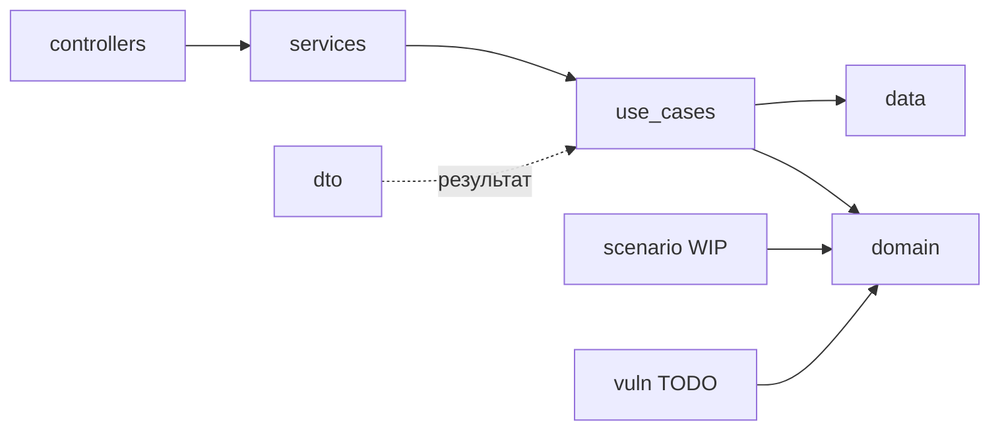

# Архитектура

<!--
  Стек/слои/развёртывание — <methodology-repo>/docs/REFERENCE.md,
  LAYOUT.md, DEPLOYMENT.md; процедура архитектуры —
  <methodology-repo>/docs/ARCHITECTURE.md.
  Состав программы — в хабе cybercity/COMPOSITION.md; здесь — только этот
  сервис и его граница. `<methodology-repo>` =
  [TheCipherKeeper/addm](https://github.com/TheCipherKeeper/addm).
-->

[`<methodology-repo>`] =
[TheCipherKeeper/addm](https://github.com/TheCipherKeeper/addm).
Состав программы — в
[`cybercity/COMPOSITION.md`](https://github.com/TheCipherKeeper/cybercity/blob/main/COMPOSITION.md);
конвенции envelope — в
[`cybercity/CONVENTIONS.md`](https://github.com/TheCipherKeeper/cybercity/blob/main/CONVENTIONS.md);
ADR — в
[`cybercity/adr/`](https://github.com/TheCipherKeeper/cybercity/blob/main/adr/README.md).

- [README](../README.md)
- [Conventions per-org layout](ORGANIZATIONS.md)
- [CI/CD-пайплайны](PIPELINES.md)
- [Руководство разработчика](DEVELOPMENT.md)
- [Спеки модулей](specs/)
- [Индекс ADR (хаб)](https://github.com/TheCipherKeeper/cybercity/blob/main/adr/README.md)

## Что это

`cybercity-data` — декларативная модель города (source of truth) + авторинг
сценариев/уязвимостей + сборка артефактов; Python-пакет с CLI `cybercity-data`.
Роль и контракты сервиса в программе — в
[`cybercity/COMPOSITION.md`](https://github.com/TheCipherKeeper/cybercity/blob/main/COMPOSITION.md).

## Что делает

1. **Авторит модель города** как код: `organizations/<org>/config.yml` —
   организации, сети, сервисы, направленные связи (v3.0: только топология, IP
   генерируются аллокатором).
2. **Валидирует** модель: 13 cross-field правил (`checker`) — единственный
   контракт правды; что не прошло `check`, не попадает в `build`/`engine.zip`.
3. **Генерирует адресацию**: `allocator` — IP/CIDR воспроизводимо через `--seed`
   (иначе случайная).
4. **Собирает артефакты**: `build` пишет `engine.zip`, `topology.json`,
   `attack-surface.json`, `schema.json`, `network.json/.md/.html`,
   `inventory.md`, `changes.json` — контракт **data → engine/ui/manage**
   (out-of-band файлы).
5. **(WIP) Авторит сценарии** — цели, injects, флаги, scoring-rubric, timebox
   (контракт **data → engine**, out-of-band). В работе.
6. **(TODO) Авторит уязвимости** — first-class сущность: манифест +
   overlay-исходники, `realism ∈ {real, narrative}`; `cve_id` в vuln-сущности
   ([ADR-0006](https://github.com/TheCipherKeeper/cybercity/blob/main/adr/0006-vulnerability-declarative-overlay-realism.md)).
   Не начат.
7. **(TODO) Публикует `city.build.completed`** в брокер — событие готовности
   сборки (контракт **data → engine/manage** через брокер,
   [ADR-0010](https://github.com/TheCipherKeeper/cybercity/blob/main/adr/0010-data-broker-producer.md)).
   Файловые артефакты остаются; событие — уведомление об их готовности. К
   заводу (Phase 2: `EventPublisher` port + Redpanda adapter).

## Чего не делает

- Не исполняет сценарии — `engine` исполняет; `data` только порождает
  декларацию.
- Не собирает образы из `overlays` — `manage` (generic consumer) собирает.
- Не владеет world-state/persistence — `engine` единственный мутатор.
- Не выставляет presentation-эндпоинты (HTTP/WS) — это CLI-инструмент + broker
  producer. Артефакты (`topology.json` и др.) — out-of-band файлы, не
  эндпоинты (см. Доверительная граница).
- Не является consumer'ом брокера — только producer (на текущей фазе).

## Модули

Сервис имеет один самостоятельный модуль модели города. Существующие пакеты
`domain`, `data`, `use_cases`, `dto`, `services` и `controllers` являются его
внутренней реализацией и сохраняются без изменения поведения в этой миграции.

| Модуль | Ответственность | Спецификация | Язык | Канонический корень | Проверка границ |
|---|---|---|---|---|---|
| `city_model` | Проверка декларативной модели и сборка артефактов города | `docs/specs/city_model.md` | python | `src/cybercity_data/city_model/` | VER-015 |



## Брокер

Брокер — **Redpanda** (Kafka-протокол); адрес из `docker-compose.yml` сервис
`broker` (`broker:9092`). **Контракты хаба: `CONVENTIONS@v1`** — пин версии, по
которой гейт проверяет сервис
([`<methodology-repo>`/docs/OPERATIONS.md](https://github.com/TheCipherKeeper/addm/blob/main/docs/OPERATIONS.md)
+ `docs/WORKFLOW.md`). Бамп пина — отдельным PR. Формат сообщений (envelope:
`event_id`/`parent_event_ids`/`correlation_id`/`tick`/`source_type`/…/`status`) —
[`cybercity/CONVENTIONS.md`](https://github.com/TheCipherKeeper/cybercity/blob/main/CONVENTIONS.md).

| Топик | Направление | Назначение |
|---|---|---|
| `city.build.completed` | publish | уведомление о готовности сборки (`engine.zip` и артефакты) для engine/manage; payload: путь/версия артефактов. Реализация — Phase 2 (ADR-0010). |
| (потребление) | consume | **нет** (на текущей фазе `data` — только producer). |

> Продуктовое решение о переходе data в broker-участника —
> [ADR-0010](https://github.com/TheCipherKeeper/cybercity/blob/main/adr/0010-data-broker-producer.md).
> Реализация публикатора (`EventPublisher` output port в `ports/` + Redpanda
> adapter в `adapters/`) — Phase 2; состояние хранится в хабовом бэклоге и в
> спеке модуля `build` (`docs/specs/build.md`).

## Потоки данных

```mermaid
flowchart LR
  YAML["organizations/<id>/config.yml"] --> SVC["data:loader"]
  SVC --> AL["data:domain/allocator"]
  AL --> CHK["data:domain/checker"]
  CHK --> RND["data:renderer"]
  RND --> FS["data:filesystem"]
  FS --> ZIP["data:zip"]
  ZIP --> ART["build/engine.zip + topology.json + overlays"]
  ART -. out-of-band файлы .--> ENG["engine/ui/manage"]
  ZIP -->|TODO: city.build.completed| BR["broker"]
  BR --> ENG2["engine/manage"]
```

Именованные потоки:

- **build-pipeline** — `loader → allocator → checker → renderer → filesystem → zip → build/`.
  Шаги реализованы как `_load`/`_allocate`/`_validate`/`_render`/`_write`,
  каждый тестируется изолированно. При ошибках `checker` рендеринг/сборка
  пропускаются.
- **data → engine/ui (out-of-band файлы)** — `engine.zip` (внутри
  `runtime/engine.json`, `topology.json`, `attack-surface.json`, `schema.json`)
  + `topology.json` для ui (v0, до перехода на presentation engine) +
  `overlays`-артефакт для manage.
- **data → engine/manage (broker)** — (TODO) публикация `city.build.completed`
  по готовности сборки; файловые артефакты остаются, событие — уведомление.

`build/` лежит в `.gitignore`; CI генерирует артефакты заново (см.
[PIPELINES.md](PIPELINES.md)).

## Доверительная граница

`cybercity-data` — CLI-инструмент сборки + broker producer; работает в
trusted-плоскости (mgmt-сегмент), публикует событие готовности в брокер.
Presentation-эндпоинты (HTTP/WS) для интерфейсов — **N/A**: `data` их не
выставляет; артефакты (`engine.zip`/`topology.json`/`overlays`) — out-of-band
файлы, не эндпоинты; брокер-участник только как producer (`city.build.completed`),
consumer: нет (Phase 2). Доверенная плоскость и обоснование — в
[`cybercity/COMPOSITION.md`](https://github.com/TheCipherKeeper/cybercity/blob/main/COMPOSITION.md)
→ *Доверительная граница* и
[ADR-0002](https://github.com/TheCipherKeeper/cybercity/blob/main/adr/0002-trust-boundary.md).

## Деплой

Контейнер со своим `Dockerfile` (Python 3.12-slim, установка через uv/pip из
`pyproject.toml`, entrypoint `cybercity-data` CLI). Контейнер запускает сборку
и публикует `city.build.completed` (после Phase 2). Локальная разработка —
корневой `docker-compose.yml` (брокер `broker` + этот сервис `data`).
Системный compose (все 4 сервиса) — в хабе `cybercity`. Соответствие хабу на
пине `CONVENTIONS@v1` — verification gate
([`<methodology-repo>`/docs/OPERATIONS.md](https://github.com/TheCipherKeeper/addm/blob/main/docs/OPERATIONS.md)).

## Ссылки

- Хаб: [`cybercity/COMPOSITION.md`](https://github.com/TheCipherKeeper/cybercity/blob/main/COMPOSITION.md),
  [`cybercity/CONVENTIONS.md`](https://github.com/TheCipherKeeper/cybercity/blob/main/CONVENTIONS.md),
  [`cybercity/adr/`](https://github.com/TheCipherKeeper/cybercity/blob/main/adr/README.md).
- Методология: [`<methodology-repo>`](https://github.com/TheCipherKeeper/addm)
  (`docs/INDEX.md`, `docs/ARCHITECTURE.md`, `docs/WORKFLOW.md`).
- Свои docs: [ORGANIZATIONS.md](ORGANIZATIONS.md), [PIPELINES.md](PIPELINES.md),
  [DEVELOPMENT.md](DEVELOPMENT.md), [specs/](specs/).

## CLI

```bash
cybercity-data check [PATH] [--json] [--strict] [--seed SEED]   # validate only
cybercity-data build [PATH] [--out DIR] [--json] [--strict] [--clean] [--seed SEED]
cybercity-data init ID --kind KIND [--path PATH] [--empty]
```

- `check` — только валидация.
- `build` — валидация + запись артефактов; пропускается при ошибках.
- `init` — скаффолд новой организации; `--empty` — минимальный шаблон.
- `--strict` — предупреждения считаются ошибками.
- `--clean` — удалить выходной каталог перед рендерингом.
- `--seed` — воспроизводимая аллокация; без флага — свежая случайная.

## Cross-field правила (checker)

| Код | Уровень | Что проверяет |
|---|---|---|
| `ids` | error | уникальный id для org/network/service; уникальная связь `(from,to,kind)` |
| `refs` | error | `service.org_id` и endpoints связи существуют |
| `network-belongs` | error | `service.network_id` существует и принадлежит той же org |
| `ip-in-network` | error | сгенерированный `bind_ip` лежит внутри сгенерированного CIDR сети |
| `ip-unique` | error | сгенерированный `bind_ip` уникален внутри одной сети |
| `network-overlap` | error | сгенерированные CIDR не пересекаются |
| `ip-scheme` | error | сгенерированные CIDR лежат под `10.<org_index>.x.x` |
| `exposure-network` | error | `exposure` разрешён для `kind` сети |
| `self-loop` | error | связь не указывает на саму себя |
| `software` | error | `cve_id` соответствует `CVE-YYYY-NNNNN` (только формат) |
| `assets` | warning | каталог ассетов сервиса соответствует объявленному сервису |
| `honeypot-criticality` | error | honeypot-сервисы не помечены `critical` |
| `honeypot-write-real` | error | honeypot-сервисы не пишут/бэкапят реальные сервисы |

## Артефакты (build/)

`network.json` (канонический дамп без сгенерированных IP), `network.md`
(человекочитаемая проекция), `schema.json` (JSON Schema), `topology.json`
(граф для UI/симулятора с `bind_ip`/`network_index`), `network.html`
(интерактивный просмотрщик), `attack-surface.json` (публично открытые сервисы),
`inventory.md` (каталоги ассетов), `changes.json` (git-дифф относительно
предыдущей сборки), `engine.zip` (пакет runtime для `cybercity-engine`; внутри
`runtime/engine.json`, `topology.json`, `attack-surface.json`, `schema.json`).

## Лицензии

- Код / YAML: [MIT](../LICENSE)
- Документация: [CC BY 4.0](../LICENSE-DOCS)
