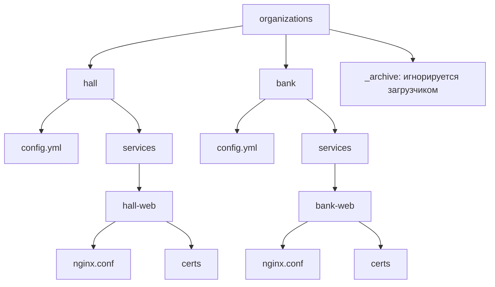

# Организации

Карточки организаций в формате **1 папка = 1 организация**.
Внутри папки — один файл `config.yml`.

- [Architecture](../docs/ARCHITECTURE.md)
- [Main README](../README.md)

## Зачем отдельные файлы

- Правка одной org — diff в одном `config.yml`.
- LLM-агент читает один файл за раз.
- Люди ревьюят изменения по org.
- Loader собирает всё в `CityNetwork` в памяти.

## Структура каталогов



## Шаблон `config.yml`

```yaml
id: hospital            # должен совпадать с именем папки
name: "City General Hospital"
kind: healthcare             # government | healthcare | infra-utilities | finance |
                             # retail | media-telecom | education | msp

# Краткое описание (необязательно, но рекомендуется).
description: |
  Опиши в 2-4 строках роль, типичные сервисы и связи с другими org.

# Сети организации (ОБЯЗАТЕЛЬНЫ в v3.0).
# Их CIDR выделяет билдер автоматически из роли сети (kind).
networks:
  - id: hospital-dmz
    kind: dmz
  - id: hospital-lan
    kind: lan
  - id: hospital-mgmt
    kind: mgmt

# Сервисы организации. `org_id` не пишется — loader подставляет из папки.
# `network_id` — логическое размещение; bind_ip генерируется автоматически.
services:
  - id: hosp-web
    name: "Hospital portal"
    description: "Публичный портал больницы"   # необязательно
    kind: web                  # web | api | pos | identity | db | file-share |
                               # rmm | vpn | ot | cctv | mail | dns | ntp |
                               # backup | log | erp | hrms | billing | tickets |
                               # wiki | crm | pharmacy-front | iot
    exposure: public           # public | intranet | ot | mgmt
    host: portal.hospital.corp
    network_id: hospital-dmz
    auth: sso
    data_classification: public
    criticality: high          # critical | high | medium | low
    software:
      vendor: nginx
      product: nginx
      version: "1.24.0"
      cve_id: "CVE-2023-1234"   # опционально, формат CVE-YYYY-NNNNN
    os_hint: linux
    ports: [tcp/443, tcp/80]

  # Honeypot-сервис (наживка, purpose-флаг; runtime_kind — НЕ здесь, deployment-time).
  - id: honeypot-printer-01
    name: "Honeypot printer"
    kind: iot
    exposure: intranet
    host: honeypot-printer-01.hospital.corp
    network_id: hospital-lan
    criticality: low
    ports: [tcp/9100, tcp/80]
    honeypot:
      kind: printer
      fingerprint: realistic
      os_hint: linux-embedded
      note: "honeypot endpoint"

# Связи, в которых ЭТА организация - источник.
links:
  - from_service: hosp-web
    to_service: external-idp
    kind: auth                 # api-call | auth | db-read | db-write | log-sink |
                               # backup-of | trusts | vendor-vpn | dns-query | ntp-query
    protocol: tcp/443
    encryption: tls
    label: "federated authentication"
```

## Схема адресации

Каждая организация получает уникальный `network_index` — второй октет
городского адресного пространства `10.0.0.0/8`.  Билдер выделяет его
автоматически при каждой сборке (случайно, если не передан `--seed`).

Подсети внутри организации строятся по правилу:

- `dmz` / `internet` — третий октет `0-127` (до 128 сетей `/24`).
- `lan` / `ot` — третий октет `128-252` (до 125 сетей `/24`).
- `mgmt` — третий октет `253`, только одна такая сеть.

IP сервисов (`bind_ip`) выдаются внутри соответствующей сети, начиная с `.10`.

## Соглашения

- **1 папка = 1 организация.** Имя папки совпадает с `id` в `config.yml`.
- **`config.yml` — единственный файл данных** в папке.
- **`services[].org_id` не пишется.** Loader подставляет автоматически.
- **`networks` обязательны.** Loader не создаёт сети; их роли и порядок влияют на автоматическое распределение.
- **`services[].network_id` обязателен.** Он задаёт логическое размещение; конкретный IP генерируется.
- **Не указывай `network_index`, `cidr`, `bind_ip`.** Эти поля удалены из декларативной модели.
- **Опциональные ассеты сервисов** — в `services/<svc-id>/`. Имя папки должно
  совпадать с `id` сервиса из `config.yml`; иначе loader выдаст warning.
- **`honeypot` — флаг назначения-наживки (honeypot/bait).** `runtime_kind` (vm/container/lite) —
  deployment-time, живёт в `cybercity-manage`, НЕ здесь.
- **links живут в папке from-организации.**
- **Уникальность `(from, to, kind)`** для link'ов.
- **Underscore-папки игнорируются.** `_archive/`, `_draft/`, `_wip/`.
- **Сценарии и уязвимости** — в соседних репозиториях, потребляют эту модель.
- **Нет свободных narrative-полей у организации.** `description` — единственный
  человекочитаемый блок. Если нужны заметки, используй YAML-комментарии (`#`).
- **CLI помогает начать:** `cybercity-data init my-org --kind government`
  создаёт шаблон с примером сети и сервиса. Флаг `--empty` даёт пустой шаблон.
- **Сборка:** `cybercity-data build . --clean` пересоздаёт `build/` с актуальными
  артефактами (`network.json`, `attack-surface.json`, `inventory.md`, `changes.json`,
  `engine.zip` и др.).  Для воспроизводимой адресации добавь `--seed <int>`.
